<!-- Profile Photo -->

<!-- Name & Title Header -->

  <em>Coimbatore, Tamil Nadu, India</em> 
  <a href="https://www.linkedin.com/in/inz-madhan-ravi">&#128279; LinkedIn: inz-madhan-ravi</a>

---

## Table of Contents
- [Professional Summary](#professional-summary)
- [Skills & Expertise](#skills-and-expertise)
- [Professional Experience](#professional-experience)
- [Education](#education)
- [Licenses & Certifications](#licenses-and-certifications)
- [Personal Projects & Adventures](#personal-projects-and-adventures)
- [Community Contributions](#community-contributions)

---

<!-- ═══════════ PROFESSIONAL SUMMARY ═══════════ -->

Model-Based Development Engineer with over 3 years of experience in automotive software development, specializing in Battery Management Systems and Fuel Cell technologies. Strong expertise in MATLAB/Simulink, Stateflow, Embedded C, and Model-Based Design workflows. Proven experience working in OEM and Tier-1 environments with strict adherence to MISRA and AUTOSAR standards. Effective in requirements implementation, model optimization, testing, and production-quality code generation.

Highly skilled in MATLAB/Simulink to implement complex logics. Familiar with Bazel framework for testing C codes and YAML configuration for GitHub Action workflows. Hands-on experience with PC based oscilloscope.

A frequent contributor in MATLAB Answers and a **MVP** and **Masters badge** holder. Absolute fan of MathWorks. A curious individual up for challenges and to learn new concepts. Strongly believes Model Based Design (MBD) and Model Based Systems Engineering (MBSE) makes everything much easier and simpler.

<a href="#table-of-contents">⬆️ Back to Top</a>

---

<!-- ═══════════ SKILLS & EXPERTISE ═══════════ -->

<!-- PDF_SKILLS_START
#### Automotive & Embedded Systems
`Bare metal (direct register level programming)` · `Infineon AURIX TC375 Tricore` · `Aurix TC375 Tricore Assembly` · `miniMCDS On-Chip Memory Tracing` · `STM32` · `STM32G431(R/K)B` · `STM32H7(45/55)ZI-Q` · `STM32H735G-DK` · `Embedded C` · `C` · `MISRA C` · `Automotive SPICE (ASPICE)` · `EOL Testing`

#### Communication Protocols
`Controller Area Network (CAN)` · `Controller Area Network Flexible Data-Rate (FDCAN)` · `Unified Diagnostic Services over Controller Area Network (UDSonCAN)` · `On-Board Diagnostic2 over Controller Area Network (OBD2onCAN)` · `Unified Diagnostic Services (UDS)` · `On-board diagnostics2 (OBD2)` · `Serial Peripheral Interface (SPI)` · `Inter-Integrated Circuit (I2C)` · `Universal Asynchronous Receiver/Transmitter (UART/USART)` · `USB CDC`

#### MBD/MBSE & Simulation
`MATLAB` · `Simulink` · `Stateflow` · `Simulink Coverage` · `MATLAB App Designer` · `MATLAB Embedded Coder` · `Model-Based Design (MBD)` · `Model-Based Systems Engineering (MBSE)` · `MathWorks Profiler` · `PSIM`

#### Testing & Measurement
`MIL / SIL / HIL Testing` · `Picoscope 2208B MSO`

#### CI/CD & Development Tools
`Git` · `GitHub Actions` · `Bazel` · `Jira` · `SonarQube` · `Helix QAC` · `CodeSonar` · `YAML` · `JSON` · `Microsoft Visual Studio Code` · `Eclipse`

#### Systems Engineering & Design Tools
`Sparx Enterprise Architect` · `Rational DOORS` · `PTC Integrity` · `Printed Circuit Board (PCB) Design` · `KiCad` · `SolidWorks`

#### Engineering Software & Analysis
`ANSYS` · `LaTeX` · `Python` · `PowerShell` · `JavaScript` · `HTML` · `Apple Shortcuts` · `Digitale Signalprozessoren` · `Adaptive Signal Processing` · `Image Processing` · `Microsoft Excel` · `Microsoft Word`

#### Domain Knowledge
`Battery Management Systems (BMS)` · `Batteriemanagementsysteme` · `Fuel Cell Systems` · `Power Electronics` · `Electric Motor Controls` · `ISO 26262` · `PDM`

#### Languages
`English C1 – Professional` · `German B2 – Professional`
PDF_SKILLS_END -->

<a href="#table-of-contents">⬆️ Back to Top</a>

---

<!-- ═══════════ PROFESSIONAL EXPERIENCE ═══════════ -->

### Model Development Engineer – BMS
**Capgemini Engineering (for BMW Group AG)** – Munich, Germany
*July 2023 – October 2025*

- Developed charging management algorithms for Battery Management Systems using MATLAB/Simulink
- Implemented functional requirements in collaboration with functional and system developers
- Executed Model-in-the-Loop and Software-in-the-Loop test runs and generated automated test reports using GitHub Actions
- Generated Embedded C code using MATLAB Embedded Coder with Bazel framework integration
- Optimized model logic and resolved defects identified during testing phases
- Performed Model-in-the-Loop, Software-in-the-Loop, and Hardware-in-the-Loop validation
- Ensured compliance with MISRA and AUTOSAR modeling and coding standards
- Utilized SonarQube for code quality metrics and quality gates, Helix QAC for coding standards compliance, and CodeSonar for advanced static analysis to detect potential software defects.
- Analyzed HIL-level defects down to low-level artifacts (.c, .a2l, .slx)
- Reviewed peer pull requests and supported continuous integration workflows

---

### Fuel Cell Development Engineer
**AVL** – Warsaw, Poland
*December 2022 – May 2023*

- Developed and validated fuel cell system models
- Performed system-level simulations using MATLAB/Simulink
- Supported testing, analysis, and validation activities for fuel cell powertrain components

---

### Fuel Cell Intern
**AVL** – Warsaw, Poland
*August 2022 – November 2022*

- Assisted in fuel cell system modeling and simulation tasks
- Supported senior engineers with data analysis and validation activities

---

### Virtual C-Ops Associate
**Amazon** – Remote
*July 2021 – July 2022*

- Executed operational support tasks in a virtual environment
- Ensured process compliance, data accuracy, and service quality

<a href="#table-of-contents">⬆️ Back to Top</a>

---

<!-- ═══════════ EDUCATION ═══════════ -->

### Bachelor of Engineering – Electric and Hybrid Vehicle Engineering
**Warsaw University of Technology**
*2016 – 2022* | Grade: **4.42**

<a href="#table-of-contents">⬆️ Back to Top</a>

---

<!-- ═══════════ LICENSES & CERTIFICATIONS ═══════════ -->

#### Certificate WBT SEPA M1 – System Engineering Fundamentals
**AVL** | Issued December 2022

---

#### Stateflow Onramp
**MathWorks** | Issued November 2022

---

#### GOETHE-ZERTIFIKAT B2
**Goethe-Institut e.V.** | Issued February 2022 | Skills: Deutsch

<a href="#table-of-contents">⬆️ Back to Top</a>

---

<!-- ═══════════ PERSONAL PROJECTS & ADVENTURES ═══════════ -->

> *Adventure in hands-on projects goes on :)!*

### GitHub Actions CI Pipeline for Infineon AURIX TC375
- Built a GitHub Actions CI pipeline for Infineon AURIX TC375 firmware development using GCC and Memory Utilization Dashboard **from scratch**
- Validates builds automatically on each commit and generates firmware artifacts including **ELF, HEX, MAP, LST**, and size reports
- Achieved reproducible builds across local and cloud environments, handling artifact retention and daily Markdown report generation
- Powershell script for fetching latest builds and flashing it in Infineon AURIX TC375 using **Aurix Flasher**
- Automated HTML report generation through MATLAB using GitHub API methods and PowerShell scripts in CI
- Created a `MATLABDiffGenerator` to produce extended inline diffs that go beyond the default GitHub diff view
- Added a live view grapher custom JavaScript function in the existing Aurix TCF VSCode Debugger for better understanding of system behavior
- Utilized **Apple Shortcuts** to trigger workflow dispatch for higher precision than cron schedulers, and to convert Markdown files to CSS-styled HTML for mobile readability
- *Only for Personal Use.*

---

### Variable PWM using GTM Module TOM – Infineon AURIX TC375
Implemented **bare metal register level programming** to perform Variable PWM using GTM Module TOM in Infineon AURIX Tricore 375 and validated behaviour using **Picoscope 2208B MSO**.

---

### ISR Execution & Latency Measurement – AURIX TC375
Measured AURIX Tricore TC375 ISR execution and ISR Latency using **CPU Performance Counter** and validated it through hardware GPIO measurement using **Picoscope 2208B MSO**.

---

### GCC vs Tasking Compiler Assembly Analysis – AURIX TC3xx
Analyzed AURIX Tricore TC3xx **GCC Compiler vs Tasking Assembly** with same and different optimization flags, thereby understanding the AURIX Tricore TC375's architecture very well.

---

### STM32 Embedded Systems & Communication Protocols
- Hands-on with **Picoscope 2208B MSO** and **STM32G431(R/K)B / STM32H7(45/55)ZI-Q / STM32H735G-DK** using HAL Libraries and **pure direct register level programming**
- Implemented **FD/CAN, SPI, I2C, USB CDC, and USART** communication protocols successfully and validated using Picoscope
- Implemented indicators on **LCD TFT of STM32H735G-DK** for crucial data display
- Performed **UDS on CAN** on real vehicle using STM32 *(OBD2 on CAN – yet to be done)*

---

### Vehicle CAN Reverse Engineering & Logging
- Developed **MATLAB application** which logs vehicle's CAN Frames, plots bytes using CAN ID in real time, visualizes all CAN IDs bytes using STM32H735G-DK
- Successfully **reverse engineered CAR CAN IDs** – identifying what each CAN ID and its bytes represent
- Used **C for logging** to reduce overhead and capture all CAN Frames at ~150 microseconds intervals
- Designed a **PCB** to interface STM32G431KB with OBD2 port

<a href="#table-of-contents">⬆️ Back to Top</a>

---

<!-- ═══════════ COMMUNITY CONTRIBUTIONS ═══════════ -->

- **[MATLAB Answers - Profile](https://www.mathworks.com/matlabcentral/profile/authors/12308260-madhan-ravi)** – Frequent contributor, **MVP** and **Masters badge** holder
- A blog about me due to highest contributions in MATLAB Answers: **[Community Q&A – Madhan Ravi](https://blogs.mathworks.com/community/2019/02/28/community-qa-madhan-ravi/)**
- Passionate advocate of MathWorks ecosystem and Model-Based Design methodology

<a href="#table-of-contents">⬆️ Back to Top</a>

---

<!-- Footer -->

